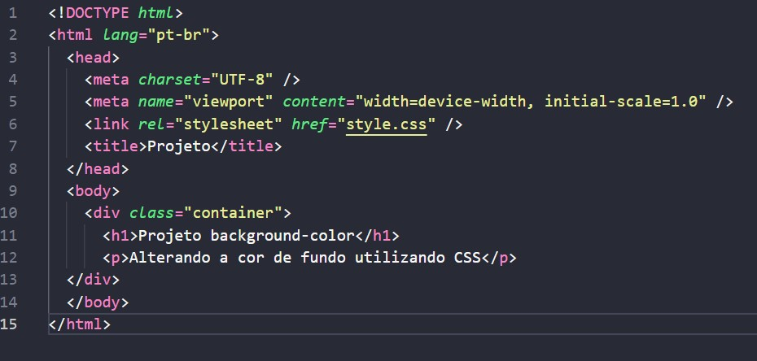
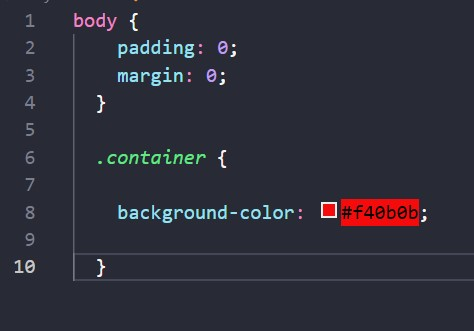

### 
Projeto tem como objetivo demonstrar o uso da propriedade background-color em HTML e CSS para alterar a cor de fundo.

=> Crie uma pasta para o projeto e dentro dela crie os seguintes arquivos: index.html e style.css.

=> Abra o arquivo index.html e insira o seguinte código para criar uma estrutura básica de HTML:

 

=> Abra o arquivo style.css e insira o seguinte código para estilizar a página:

 

=> No Style.css voce pode alterar a cor, colocando a cor desejada. 

Segue alguns exemplos :

color: #ff0000;     /* Vermelho */
color: #00ff00;     /* Verde */
color: #0000ff;     /* Azul */
color: #000000;     /* Preto */
color: #ffffff;     /* Branco */